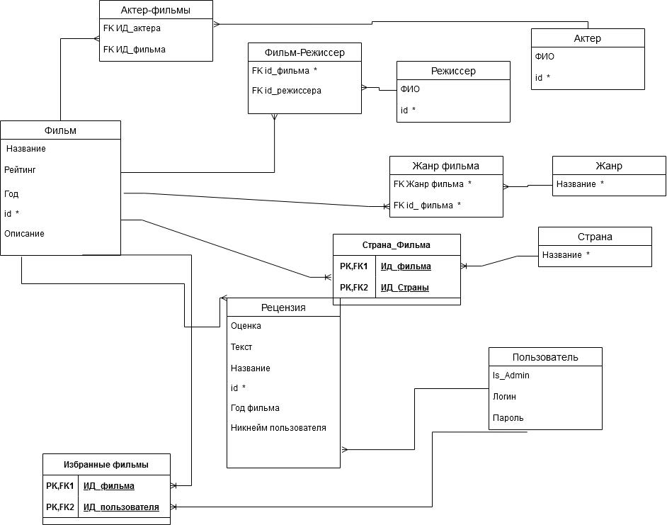
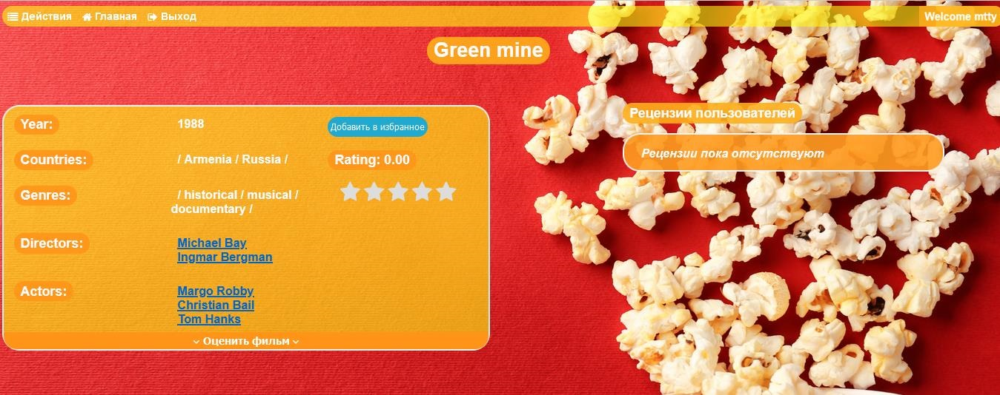
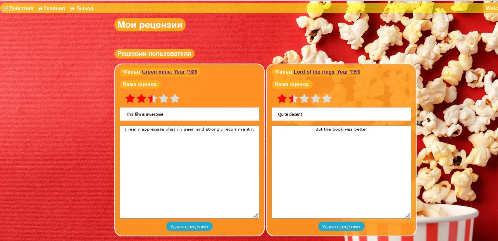

# Web-Application--Onlime-Film-Database--Back-End--Flask--PostgreSQL
**A web-based indexing and search service application for movies and related information, allowing users to search for movies by criteria, rate and leave reviews, and add new movies, directors, and actors.**

Available user role description:

Regular user - can register on the site. After that, they will be presented with a list of movies that they can select by year of release, genre, actors who starred in those movies and country of production. Users can familiarize themselves with the key plot points in detail. They can read reviews by other users. Users can sort movies by year of release, country of production, write extended reviews and score the movie.

Administrator - he main task of the moderator is to maintain the directory. Upload and update new information about the movie. To give descriptions of the movie, actors and directors. To edit and delete reviews. 

***Some of the application functionality***

Database structure:

Registration form:

Available actions of an authorized user:

Available administrator actions:

Adding an actor:

Adding movie and interactive data for a movie:

Movie search page:

Adding sorting criteria (genre and country):

Tooltips when entering a movie title:

Sorting by release year:

Selected Films:

Movie page:

Adding a movie score:

A few reviews:

User reviews:

